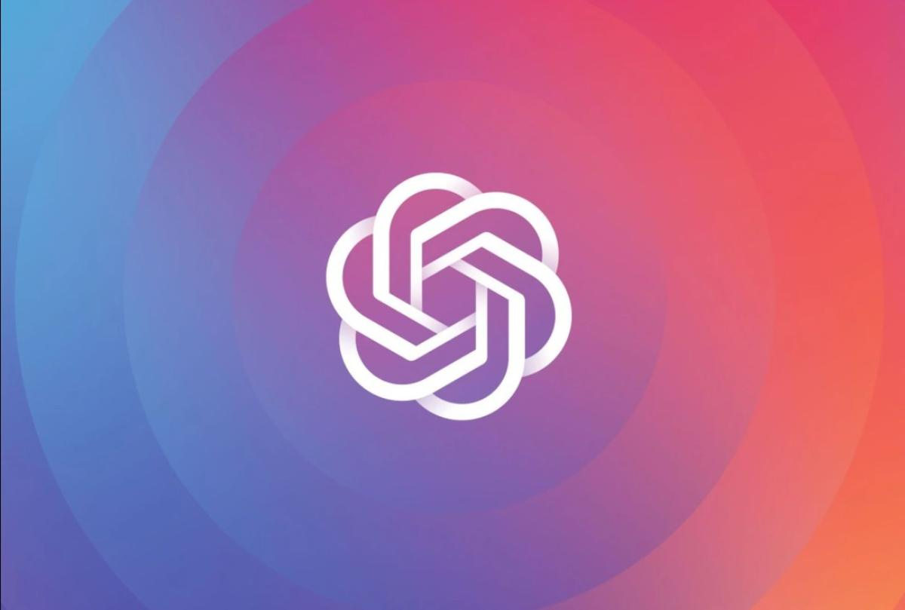
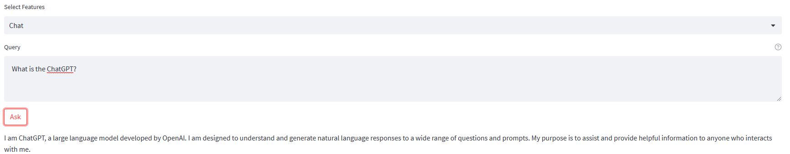
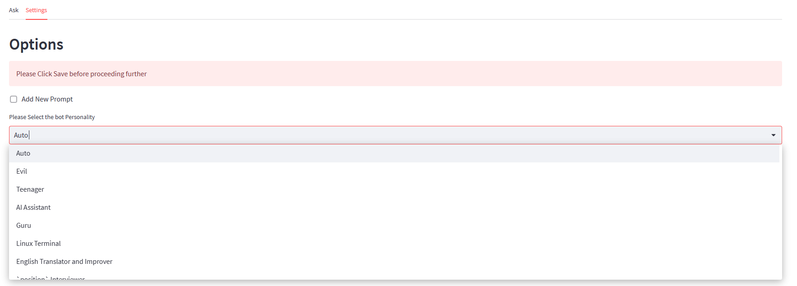
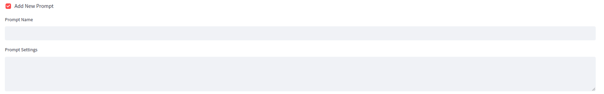

  
  <h1 align="center">Free GPT4 GUI😀</h1>
  
 Allows you to use GPT4 For Free (No Conversation Limit) 

**An Awesome Web Gui For Both GPT-4, BingGPT and Falcon AI , with hundreds of built in prompts and features that work out of the box without any API Keys!😄 (Uses Major API Providers like Ora.sh)**

**[🚀 Download APP 🚀](https://github.com/vaibhavard/Free-GPT4-GUI/raw/main/AwesomeGPT-GUI.exe)**

> ### Usage
Just Download and run  **[AwesomeGPT-GUI.exe](https://github.com/vaibhavard/Free-GPT4-GUI/raw/main/AwesomeGPT-GUI.exe)**  and Ask!

> ### Source Code
**I have currently kept the source code of the app *secret* , since this app exploits some flaws in Different Websites and API (Such as BingAI)** (programmed in python). 
If you want the source code you can contact me @ vaibhavarduino@gmail.com

> ### Examples

> #### You can change the settings to select Hundred of differnet prompts in the website as follows

**Thank you for using Free GPT4 GUI! If you have any questions or issues, please feel free to contact the developer.**

